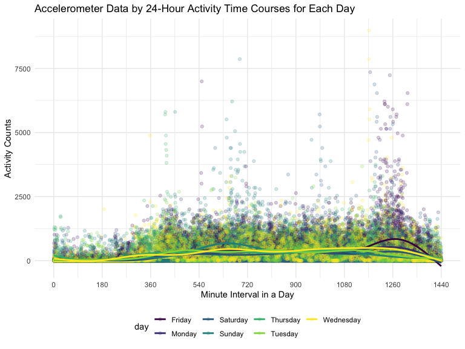
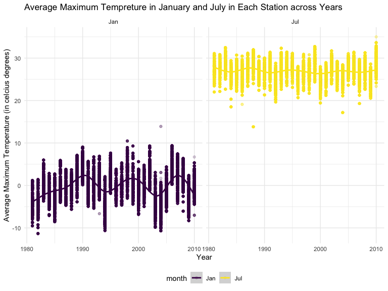
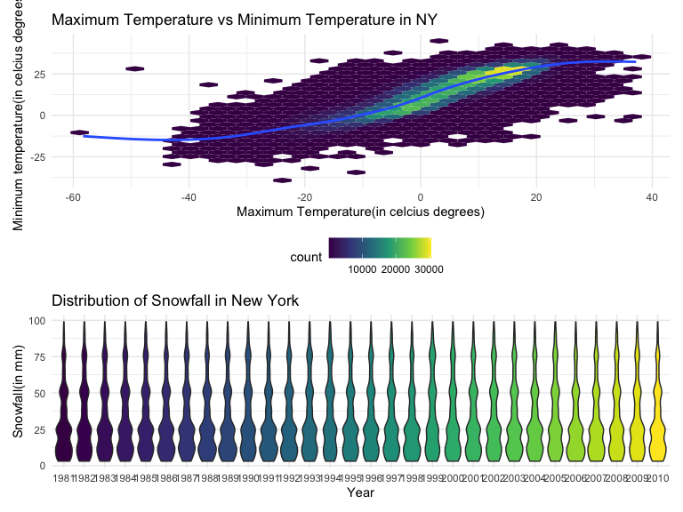

p8105_hw3_yy3297
================
Yunxi Yang
2022-10-13

### Problem 1

#### Read in the data

``` r
data("instacart")

instacart = 
  instacart %>% 
  as_tibble(instacart)
```

#### Answer questions about the data

This dataset contains 1384617 rows and 15 columns, with each row
resprenting a single product from an instacart order. Variables include
identifiers for user, order, and product; the order in which each
product was added to the cart. There are several order-level variables,
describing the day and time of the order, and number of days since prior
order. Then there are several item-specific variables, describing the
product name (e.g. Yogurt, Avocado), department (e.g. dairy and eggs,
produce), and aisle (e.g. yogurt, fresh fruits), and whether the item
has been ordered by this user in the past. In total, there are 39123
products found in 131209 orders from 131209 distinct users.

Below is a table summarizing the number of items ordered from aisle. In
total, there are 134 aisles, with fresh vegetables and fresh fruits
holding the most items ordered by far.

``` r
instacart %>% 
  count(aisle) %>% 
  arrange(desc(n))
```

    ## # A tibble: 134 × 2
    ##    aisle                              n
    ##    <chr>                          <int>
    ##  1 fresh vegetables              150609
    ##  2 fresh fruits                  150473
    ##  3 packaged vegetables fruits     78493
    ##  4 yogurt                         55240
    ##  5 packaged cheese                41699
    ##  6 water seltzer sparkling water  36617
    ##  7 milk                           32644
    ##  8 chips pretzels                 31269
    ##  9 soy lactosefree                26240
    ## 10 bread                          23635
    ## # … with 124 more rows

Next is a plot that shows the number of items ordered in each aisle.
Here, aisles are ordered by ascending number of items.

``` r
instacart %>% 
  count(aisle) %>% 
  filter(n > 10000) %>% 
  mutate(aisle = fct_reorder(aisle, n)) %>% 
  ggplot(aes(x = aisle, y = n)) + 
  geom_point() + 
  labs(title = "Number of items ordered in each aisle") +
  theme(axis.text.x = element_text(angle = 60, hjust = 1))
```


Our next table shows the three most popular items in aisles
`baking ingredients`, `dog food care`, and `packaged vegetables fruits`,
and includes the number of times each item is ordered in your table.

``` r
instacart %>% 
  filter(aisle %in% c("baking ingredients", "dog food care", "packaged vegetables fruits")) %>%
  group_by(aisle) %>% 
  count(product_name) %>% 
  mutate(rank = min_rank(desc(n))) %>% 
  filter(rank < 4) %>% 
  arrange(desc(n)) %>%
  knitr::kable()
```

| aisle                      | product_name                                  |    n | rank |
|:---------------------------|:----------------------------------------------|-----:|-----:|
| packaged vegetables fruits | Organic Baby Spinach                          | 9784 |    1 |
| packaged vegetables fruits | Organic Raspberries                           | 5546 |    2 |
| packaged vegetables fruits | Organic Blueberries                           | 4966 |    3 |
| baking ingredients         | Light Brown Sugar                             |  499 |    1 |
| baking ingredients         | Pure Baking Soda                              |  387 |    2 |
| baking ingredients         | Cane Sugar                                    |  336 |    3 |
| dog food care              | Snack Sticks Chicken & Rice Recipe Dog Treats |   30 |    1 |
| dog food care              | Organix Chicken & Brown Rice Recipe           |   28 |    2 |
| dog food care              | Small Dog Biscuits                            |   26 |    3 |

Finally is a table showing the mean hour of the day at which Pink Lady
Apples and Coffee Ice Cream are ordered on each day of the week. This
table has been formatted in an untidy manner for human readers. Pink
Lady Apples are generally purchased slightly earlier in the day than
Coffee Ice Cream, with the exception of day 5.

``` r
instacart %>%
  filter(product_name %in% c("Pink Lady Apples", "Coffee Ice Cream")) %>%
  group_by(product_name, order_dow) %>%
  summarize(mean_hour = mean(order_hour_of_day)) %>%
  spread(key = order_dow, value = mean_hour) %>%
  knitr::kable(digits = 2)
```

    ## `summarise()` has grouped output by 'product_name'. You can override using the
    ## `.groups` argument.

| product_name     |     0 |     1 |     2 |     3 |     4 |     5 |     6 |
|:-----------------|------:|------:|------:|------:|------:|------:|------:|
| Coffee Ice Cream | 13.77 | 14.32 | 15.38 | 15.32 | 15.22 | 12.26 | 13.83 |
| Pink Lady Apples | 13.44 | 11.36 | 11.70 | 14.25 | 11.55 | 12.78 | 11.94 |

### Problem 2

#### Import and Clean the data

First, load and clean the accelerometer data set named as “accel_data”.
In this step, we will rename the variables with more clear and
meaningful titles, and also we will add in the weekend/weekday variables
into the data frame.

``` r
accel_data_df = 
  read_csv("p8105_hw3_data/accel_data.csv") %>%
  janitor::clean_names() %>% 
  pivot_longer(
    cols = activity_1 : activity_1440,
    names_to = 'activity_time_course_number',
    values_to = 'activity_counts'
  ) %>%
  mutate(
    day_type = ifelse (day == 'Saturday' |day == 'Sunday', "Weekend", "Weekday"),
    activity_time_course_number = as.numeric(substring(activity_time_course_number, 10)),
    activity_counts = as.numeric(activity_counts)
  ) %>%
  select(week, day_id, day, day_type, everything())
```

    ## Rows: 35 Columns: 1443
    ## ── Column specification ────────────────────────────────────────────────────────
    ## Delimiter: ","
    ## chr    (1): day
    ## dbl (1442): week, day_id, activity.1, activity.2, activity.3, activity.4, ac...
    ## 
    ## ℹ Use `spec()` to retrieve the full column specification for this data.
    ## ℹ Specify the column types or set `show_col_types = FALSE` to quiet this message.

``` r
accel_data_df
```

    ## # A tibble: 50,400 × 6
    ##     week day_id day    day_type activity_time_course_number activity_counts
    ##    <dbl>  <dbl> <chr>  <chr>                          <dbl>           <dbl>
    ##  1     1      1 Friday Weekday                            1            88.4
    ##  2     1      1 Friday Weekday                            2            82.2
    ##  3     1      1 Friday Weekday                            3            64.4
    ##  4     1      1 Friday Weekday                            4            70.0
    ##  5     1      1 Friday Weekday                            5            75.0
    ##  6     1      1 Friday Weekday                            6            66.3
    ##  7     1      1 Friday Weekday                            7            53.8
    ##  8     1      1 Friday Weekday                            8            47.8
    ##  9     1      1 Friday Weekday                            9            55.5
    ## 10     1      1 Friday Weekday                           10            43.0
    ## # … with 50,390 more rows

This data set contains 50400 rows and 6 columns, with each row
representing the activity counts recorded on the accelerometer during an
one-minute time interval on a specific day for a 63 year-old male with
BMI 25. Variables include week, day_id, day, day_type,
activity_time_course_number, activity_counts. The ‘week’ variable is an
order-level variable indicating the week number over the 5 testing
weeks. The ‘day_id’ is also an order-level variable describing the nth
day for data collection. The ‘day’ variable suggests on which day the
data is collected. The ‘day_type’ variable describes whether the data
collection day is a weekday or during the weekend. The
‘activity_time_course_number’ suggests the nth one-minute interval in a
day for the data collection. The ‘activity_counts’ is a continuous
variable suggesting the number of counts recorded by accelerometer.

#### Create a new table

Then, create a new table by aggregating across minutes to create a total
activity variable for each day.

``` r
accel_data_df %>% 
  group_by (day_id, day, day_type) %>% 
  summarize(activity_daily_counts = sum(activity_counts)) %>% 
  arrange(activity_daily_counts) %>%
  knitr::kable(digits = 2)
```

    ## `summarise()` has grouped output by 'day_id', 'day'. You can override using the
    ## `.groups` argument.

| day_id | day       | day_type | activity_daily_counts |
|-------:|:----------|:---------|----------------------:|
|     24 | Saturday  | Weekend  |               1440.00 |
|     31 | Saturday  | Weekend  |               1440.00 |
|      2 | Monday    | Weekday  |              78828.07 |
|     32 | Sunday    | Weekend  |             138421.00 |
|     22 | Friday    | Weekday  |             154049.00 |
|     25 | Sunday    | Weekend  |             260617.00 |
|      9 | Monday    | Weekday  |             295431.00 |
|      6 | Tuesday   | Weekday  |             307094.24 |
|     27 | Tuesday   | Weekday  |             319568.00 |
|      7 | Wednesday | Weekday  |             340115.01 |
|     26 | Thursday  | Weekday  |             340291.00 |
|      5 | Thursday  | Weekday  |             355923.64 |
|     34 | Tuesday   | Weekday  |             367824.00 |
|     19 | Thursday  | Weekday  |             371230.00 |
|      3 | Saturday  | Weekend  |             376254.00 |
|     20 | Tuesday   | Weekday  |             381507.00 |
|     17 | Saturday  | Weekend  |             382928.00 |
|     30 | Monday    | Weekday  |             389080.00 |
|     23 | Monday    | Weekday  |             409450.00 |
|     11 | Sunday    | Weekend  |             422018.00 |
|     13 | Tuesday   | Weekday  |             423245.00 |
|     28 | Wednesday | Weekday  |             434460.00 |
|     14 | Wednesday | Weekday  |             440962.00 |
|     35 | Wednesday | Weekday  |             445366.00 |
|     18 | Sunday    | Weekend  |             467052.00 |
|     15 | Friday    | Weekday  |             467420.00 |
|     21 | Wednesday | Weekday  |             468869.00 |
|     12 | Thursday  | Weekday  |             474048.00 |
|      1 | Friday    | Weekday  |             480542.62 |
|     33 | Thursday  | Weekday  |             549658.00 |
|      8 | Friday    | Weekday  |             568839.00 |
|     10 | Saturday  | Weekend  |             607175.00 |
|     29 | Friday    | Weekday  |             620860.00 |
|      4 | Sunday    | Weekend  |             631105.00 |
|     16 | Monday    | Weekday  |             685910.00 |

As for an apparent trend, only based on the table numbers, I think it is
a bit hard to observe one. While I can make a guess after arranging the
activity daily counts from the lowest to the highest. As we see, among
the top 10 daily counts, the Wednesdays’ counts occupied four places.
And the two lowest counts among the five weeks come from Saturdays’ data
collection. Thus, maybe the activity daily counts will reach a lower
level during the weekend, and will increase to a higher level during the
weekdays.

#### Make a Plot

Next, make a single-panel plot that shows the 24-hour activity time
courses for each day and use color to indicate day of the week.

``` r
accel_data_df %>%
  group_by(day_id, day, activity_time_course_number) %>%
  summarize(activity_interval_counts = sum(activity_counts)) %>% 
  ggplot(aes(x = activity_time_course_number, y = activity_interval_counts, color = day)) + 
  geom_point(alpha = 0.2) +
  geom_smooth(se = FALSE) + 
  theme(legend.position = "bottom") +
  scale_x_continuous(breaks = seq(0, 1440, by = 180)) +
  labs(
    title = "Accelerometer Data by 24-Hour Activity Time Courses for Each Day",
    x = "Minute Interval in a Day",
    y = "Activity Counts"
  )
```

    ## `summarise()` has grouped output by 'day_id', 'day'. You can override using the
    ## `.groups` argument.
    ## `geom_smooth()` using method = 'gam' and formula 'y ~ s(x, bs = "cs")'



#### Patterns and Conclusions:

From the plot above, we noticed that each day in a week shares a similar
dynamic pattern to a large extent. The activity counts remain at the
lowest level in the midnight (1st to 180th minute-intervals, which
suggests 00:00 am - 03:00 am). Next, the activity counts starts to
increase rapidly from 180th to 540th minute intervals (which suggests
03:00 am - 9:00 am). Then, the activity counts remain at a relatively
stable and high level until 1170th minute-interval(which suggests 7:30
pm). The activity accounts then begin to show a great up or down
fluctuations until the midnight (1440th minute-interval) and eventually
back to the lowest level. The activity count trend varies a little from
day to day in a week. There are a few highlights: 1. On Sunday, the
activity counts reach an outstanding higher level at around 630th
minute-interval(10:30 am); 2. At around 1260th minute-interval (which
suggests 9:00 pm), the activity counts will reach a very high level
above the average on Friday, but will reach a very low level below the
average on Tuesday and Sunday.

### Problem 3

#### Read in the data

``` r
data("ny_noaa")
```

This data set contains 2595176 rows and 7 columns, and include id, date,
prcp, snow, snwd, tmax, tmin variable. This data set have five core
variables for all New York state weather stations from January 1, 1981
through December 31, 2010. The ‘id’ suggests weather station ID. The
‘date’ means date of observation. The ‘prcp’ indicates the precipitation
in tenths of mm. The ‘snow’ means snowfall in mm. The ‘snwd’ suggests
snow depth in mm. The ‘tmax’ means maximum temperature in tenths of C
degrees. The ‘tmin’ suggests minimum temperature in tenths of C degrees.

Do some data cleaning. Create separate variables for year, month, and
day. Ensure observations for temperature, precipitation, and snowfall
are given in reasonable units. For snowfall, what are the most commonly
observed values? Why? \#### Data cleaning

Clean the data set, and create seperate variables for year, month, and
day. As for ‘prcp’, I convert its unit of ‘in tenths of mm’ into ‘mm’ by
divided by 10. As for ‘tmax’ and ‘tmin’, I convert their units of ‘in
tenths of Celcius degress’ into ‘celcius degress’ by divided by 10.

``` r
ny_noaa_df= 
  ny_noaa %>%
  janitor::clean_names() %>%
  separate(col = date, into = c ("year", "month", "day") , sep = "-", convert = TRUE) %>%
  mutate(
    year = as.integer(year),
    month = month.abb[month],
    day = as.integer(day),
    prcp = as.numeric(prcp) / 10,
    tmax = as.numeric(tmax) / 10,
    tmin = as.numeric(tmin) / 10
    )
ny_noaa_df
```

    ## # A tibble: 2,595,176 × 9
    ##    id           year month   day  prcp  snow  snwd  tmax  tmin
    ##    <chr>       <int> <chr> <int> <dbl> <int> <int> <dbl> <dbl>
    ##  1 US1NYAB0001  2007 Nov       1    NA    NA    NA    NA    NA
    ##  2 US1NYAB0001  2007 Nov       2    NA    NA    NA    NA    NA
    ##  3 US1NYAB0001  2007 Nov       3    NA    NA    NA    NA    NA
    ##  4 US1NYAB0001  2007 Nov       4    NA    NA    NA    NA    NA
    ##  5 US1NYAB0001  2007 Nov       5    NA    NA    NA    NA    NA
    ##  6 US1NYAB0001  2007 Nov       6    NA    NA    NA    NA    NA
    ##  7 US1NYAB0001  2007 Nov       7    NA    NA    NA    NA    NA
    ##  8 US1NYAB0001  2007 Nov       8    NA    NA    NA    NA    NA
    ##  9 US1NYAB0001  2007 Nov       9    NA    NA    NA    NA    NA
    ## 10 US1NYAB0001  2007 Nov      10    NA    NA    NA    NA    NA
    ## # … with 2,595,166 more rows

#### Find most commonly observed values for ‘snow’

Next, find the mode values among the values in the ‘snow’ column.

``` r
names(which(max(table(ny_noaa_df$snow))==table(ny_noaa_df$snow)))
```

    ## [1] "0"

Therefore, the most commonly observed values for snowfall is 0 mm. This
number makes sense and aligned with the real situation. In New York,
snowy days are not common and only occurred sometimes in winter. This
data set collects the whether data throughout the whole year, it is
reasonale that most of the snowfall data is 0 as no snowfall in most of
the days in a year.

#### Make a two-panel plot part 1

Make a two-panel plot using ggplot function to show the average max
temperature in January and in July in each station across years.

``` r
ny_noaa_df %>%
  filter(month == c("Jan", "Jul")) %>%
  drop_na(tmax) %>%
  group_by(id, year, month) %>%
  mutate(ave_tmax = mean(tmax, na.rm = TRUE)) %>%
  select(id, year, month, ave_tmax) %>%
  ggplot(aes(x = year, y = ave_tmax, color = month)) +
  geom_point(alpha = 0.2) +
  geom_smooth() +
  theme(legend.position = "bottom") +
  labs(
    x = "Year",
    y = "Average Maximum Temperature (in celcius degrees)",
    title = "Average Maximum Tempreture in January and July in Each Station across Years",
    ) + 
  facet_grid(. ~ month)
```

    ## `geom_smooth()` using method = 'gam' and formula 'y ~ s(x, bs = "cs")'



Is there any observable / interpretable structure? Any outliers? We
notice that the average maximum temperatures in July shows a more stable
cycle than that in January. The trend line shape of the change in
average maximum temperatures in July is similar to the shape of a sin
graph, and its amplitude seems to be within 5 celcius degrees. While for
the trend of the change in average maximum temperatures in January shows
a large increase from 1980 to 1990, and enters a relatively stable
up-and-down cycle after 1990. Moreover, there are few outliers we can
observe from the graph that is too far above or below the trend line for
both January and July, for example, the max temp reaches around 14 C
degrees in January in around 2004 in one station which is an outlier.

#### Make a two-panel plot part 2

Make a two-panel plot showing (i) tmax vs tmin for the full dataset

``` r
tmax_tmin_plot = ny_noaa_df %>% 
  drop_na() %>%
  ggplot(aes(x = tmin, y = tmax)) +
  geom_hex() +
  geom_smooth(se = FALSE) +
  theme(legend.position = "bottom") + 
  labs(
    title = "Maximum Temperature vs Minimum Temperature in NY",
    x = "Maximum Temperature(in celcius degrees)",
    y = "Minimum temperature(in celcius degrees)"
    )
```

2)  make a plot showing the distribution of snowfall values greater than
    0 and less than 100 separately by year.

``` r
snow_dist = ny_noaa_df %>% 
  drop_na() %>% 
  filter(snow > 0, snow < 100) %>% 
  mutate(year = as.factor(year)) %>%
  ggplot(aes(x = year, y = snow, fill = year)) +
  geom_violin() +
  theme(legend.position = "none") + 
  labs(
    x = "Year",
    y = "Snowfall(in mm)",
    title = "Distribution of Snowfall in New York"
  )
```

Make it into a two-panel plot.

``` r
tmax_tmin_plot / snow_dist
```

    ## `geom_smooth()` using method = 'gam' and formula 'y ~ s(x, bs = "cs")'


